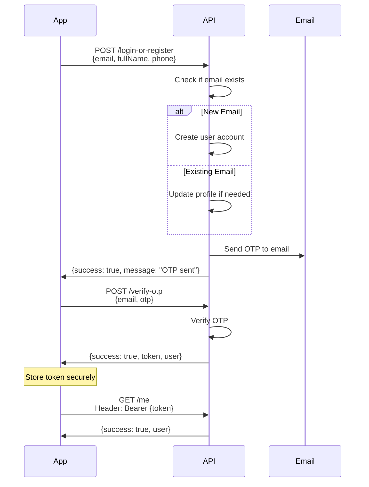

# Mobile App Authentication API Guide

**Passwordless OTP-based authentication** for mobile applications. This is a unified authentication system that handles both registration and login through a single endpoint.

---

## Table of Contents

1. [Overview](#overview)
2. [Base URLs](#base-urls)
3. [Authentication Flow](#authentication-flow)
4. [API Endpoints](#api-endpoints)
5. [Request/Response Formats](#requestresponse-formats)
6. [Code Examples](#code-examples)
7. [Error Handling](#error-handling)
8. [Token Management](#token-management)
9. [Best Practices](#best-practices)

---

## Overview

### Key Features

- **Passwordless Authentication**: No passwords required - uses email OTP verification
- **Unified Endpoint**: Single endpoint handles both registration and login
- **Automatic Profile Updates**: Name and phone are automatically updated if provided
- **Non-expiring Tokens**: Single token that doesn't expire (no refresh token needed)
- **Rate Limited**: Maximum 3 OTP requests per hour per user

### Authentication Method

1. User provides email, name, and phone (optional)
2. System checks if email exists:
   - **New email**: Creates user account
   - **Existing email**: Updates profile if name/phone changed
3. OTP is sent to user's email
4. User verifies OTP
5. System returns non-expiring authentication token
6. Token is used for all protected endpoints

---

## Base URLs

| Environment | Base URL |
|------------|----------|
| **Local Development** | `http://localhost:4000/api/mobile/auth` |
| **Production** | `https://goldfish-app-d9t4j.ondigitalocean.app/api/mobile/auth` |

**Note**: If your backend proxy strips `/api`, use `/mobile/auth` instead.

---

## Authentication Flow



---

## API Endpoints

| Method | Endpoint | Auth Required | Description |
|--------|----------|--------------|-------------|
| POST | `/login-or-register` | No | Register new user or login existing user |
| POST | `/send-otp` | No | Resend OTP to email |
| POST | `/verify-otp` | No | Verify OTP and get authentication token |
| GET | `/me` | Yes | Get current user information |

---

## Request/Response Formats

### 1. Login or Register

**Endpoint:** `POST /api/mobile/auth/login-or-register`

**Description:** Unified endpoint for registration and login. Creates new user if email doesn't exist, or updates existing user profile and sends OTP.

**Request Body:**

```json
{
  "email": "user@example.com",
  "fullName": "John Doe",
  "phone": "9812345678"
}
```

**Field Details:**

| Field | Type | Required | Description |
|-------|------|----------|-------------|
| `email` | string | Yes | Valid email address (will be normalized to lowercase) |
| `fullName` | string | No | User's full name (max 255 characters) |
| `phone` | string | No | User's phone number (max 50 characters) |

**Success Response (201 - New User):**

```json
{
  "success": true,
  "message": "OTP sent to your email.",
  "data": {
    "mobileAppUserId": "18fb92fc-8da6-4c53-b4b6-6ffeca6e240b",
    "email": "user@example.com",
    "phone": "9812345678"
  }
}
```

**Success Response (200 - Existing User):**

```json
{
  "success": true,
  "message": "OTP sent to your email.",
  "data": {
    "mobileAppUserId": "18fb92fc-8da6-4c53-b4b6-6ffeca6e240b",
    "email": "user@example.com",
    "phone": "9876543210"
  }
}
```

**Error Responses:**

- **400 Bad Request**: Validation error
  ```json
  {
    "success": false,
    "message": "Valid email required",
    "errors": [
      {
        "type": "field",
        "value": "invalid-email",
        "msg": "Valid email required",
        "path": "email",
        "location": "body"
      }
    ]
  }
  ```

- **429 Too Many Requests**: Rate limit exceeded
  ```json
  {
    "success": false,
    "message": "Maximum OTP requests reached. Please try again later."
  }
  ```

---

### 2. Send OTP (Resend)

**Endpoint:** `POST /api/mobile/auth/send-otp`

**Description:** Resend OTP to user's email. Works for both verified and unverified users.

**Request Body:**

```json
{
  "email": "user@example.com"
}
```

**Success Response (200):**

```json
{
  "success": true,
  "message": "OTP sent to your email.",
  "data": {
    "email": "user@example.com"
  }
}
```

**Error Responses:**

- **404 Not Found**: User not found
  ```json
  {
    "success": false,
    "message": "User not found"
  }
  ```

- **429 Too Many Requests**: Rate limit exceeded
  ```json
  {
    "success": false,
    "message": "Maximum OTP requests reached. Please try again later."
  }
  ```

---

### 3. Verify OTP

**Endpoint:** `POST /api/mobile/auth/verify-otp`

**Description:** Verify OTP code and receive authentication token. Token does not expire.

**Request Body:**

```json
{
  "email": "user@example.com",
  "otp": "123456"
}
```

**Field Details:**

| Field | Type | Required | Description |
|-------|------|----------|-------------|
| `email` | string | Yes | User's email address |
| `otp` | string | Yes | 6-digit OTP code (numeric) |

**Success Response (200):**

```json
{
  "success": true,
  "message": "OTP verified successfully",
  "data": {
    "user": {
      "id": "18fb92fc-8da6-4c53-b4b6-6ffeca6e240b",
      "email": "user@example.com",
      "fullName": "John Doe",
      "phone": "9812345678",
      "isEmailVerified": true
    },
    "token": "eyJhbGciOiJIUzI1NiIsInR5cCI6IkpXVCJ9..."
  }
}
```

**Error Responses:**

- **400 Bad Request**: Invalid or expired OTP
  ```json
  {
    "success": false,
    "message": "Invalid or expired OTP"
  }
  ```

- **404 Not Found**: User not found
  ```json
  {
    "success": false,
    "message": "User not found"
  }
  ```

---

### 4. Get Current User (Protected)

**Endpoint:** `GET /api/mobile/auth/me`

**Description:** Get current authenticated user information.

**Headers:**

```
Authorization: Bearer <token>
```

**Success Response (200):**

```json
{
  "success": true,
  "data": {
    "user": {
      "id": "18fb92fc-8da6-4c53-b4b6-6ffeca6e240b",
      "email": "user@example.com",
      "fullName": "John Doe",
      "phone": "9812345678",
      "isEmailVerified": true
    }
  }
}
```

**Error Responses:**

- **401 Unauthorized**: Invalid or missing token
  ```json
  {
    "success": false,
    "message": "Access token required"
  }
  ```

---

## Code Examples

### Flutter (Dart)

#### Setup

Add `http` package to `pubspec.yaml`:

```yaml
dependencies:
  http: ^1.1.0
  shared_preferences: ^2.2.0
```

#### Auth Service Class

```dart
import 'dart:convert';
import 'package:http/http.dart' as http;
import 'package:shared_preferences/shared_preferences';

class MobileAuthService {
  static const String baseUrl = 'https://goldfish-app-d9t4j.ondigitalocean.app/api/mobile/auth';
  static const String tokenKey = 'mobile_auth_token';
  static const String userKey = 'mobile_user_data';

  // Login or Register
  Future<Map<String, dynamic>> loginOrRegister({
    required String email,
    String? fullName,
    String? phone,
  }) async {
    try {
      final response = await http.post(
        Uri.parse('$baseUrl/login-or-register'),
        headers: {'Content-Type': 'application/json'},
        body: jsonEncode({
          'email': email.toLowerCase().trim(),
          if (fullName != null) 'fullName': fullName,
          if (phone != null) 'phone': phone,
        }),
      );

      final data = jsonDecode(response.body);
      
      if (response.statusCode == 200 || response.statusCode == 201) {
        return {
          'success': true,
          'data': data['data'],
        };
      } else {
        return {
          'success': false,
          'message': data['message'] ?? 'Request failed',
          'errors': data['errors'],
        };
      }
    } catch (e) {
      return {
        'success': false,
        'message': 'Network error: ${e.toString()}',
      };
    }
  }

  // Send OTP (Resend)
  Future<Map<String, dynamic>> sendOtp(String email) async {
    try {
      final response = await http.post(
        Uri.parse('$baseUrl/send-otp'),
        headers: {'Content-Type': 'application/json'},
        body: jsonEncode({'email': email.toLowerCase().trim()}),
      );

      final data = jsonDecode(response.body);
      
      if (response.statusCode == 200) {
        return {
          'success': true,
          'message': data['message'],
        };
      } else {
        return {
          'success': false,
          'message': data['message'] ?? 'Failed to send OTP',
        };
      }
    } catch (e) {
      return {
        'success': false,
        'message': 'Network error: ${e.toString()}',
      };
    }
  }

  // Verify OTP
  Future<Map<String, dynamic>> verifyOtp({
    required String email,
    required String otp,
  }) async {
    try {
      final response = await http.post(
        Uri.parse('$baseUrl/verify-otp'),
        headers: {'Content-Type': 'application/json'},
        body: jsonEncode({
          'email': email.toLowerCase().trim(),
          'otp': otp,
        }),
      );

      final data = jsonDecode(response.body);
      
      if (response.statusCode == 200 && data['success']) {
        // Save token and user data
        final prefs = await SharedPreferences.getInstance();
        await prefs.setString(tokenKey, data['data']['token']);
        await prefs.setString(userKey, jsonEncode(data['data']['user']));
        
        return {
          'success': true,
          'token': data['data']['token'],
          'user': data['data']['user'],
        };
      } else {
        return {
          'success': false,
          'message': data['message'] ?? 'OTP verification failed',
        };
      }
    } catch (e) {
      return {
        'success': false,
        'message': 'Network error: ${e.toString()}',
      };
    }
  }

  // Get Current User
  Future<Map<String, dynamic>> getCurrentUser() async {
    try {
      final prefs = await SharedPreferences.getInstance();
      final token = prefs.getString(tokenKey);
      
      if (token == null) {
        return {
          'success': false,
          'message': 'No token found',
        };
      }

      final response = await http.get(
        Uri.parse('$baseUrl/me'),
        headers: {
          'Authorization': 'Bearer $token',
        },
      );

      final data = jsonDecode(response.body);
      
      if (response.statusCode == 200 && data['success']) {
        return {
          'success': true,
          'user': data['data']['user'],
        };
      } else {
        // Token might be invalid, clear it
        await prefs.remove(tokenKey);
        await prefs.remove(userKey);
        return {
          'success': false,
          'message': data['message'] ?? 'Failed to get user',
        };
      }
    } catch (e) {
      return {
        'success': false,
        'message': 'Network error: ${e.toString()}',
      };
    }
  }

  // Check if user is logged in
  Future<bool> isLoggedIn() async {
    final prefs = await SharedPreferences.getInstance();
    final token = prefs.getString(tokenKey);
    return token != null;
  }

  // Logout
  Future<void> logout() async {
    final prefs = await SharedPreferences.getInstance();
    await prefs.remove(tokenKey);
    await prefs.remove(userKey);
  }

  // Get stored token
  Future<String?> getToken() async {
    final prefs = await SharedPreferences.getInstance();
    return prefs.getString(tokenKey);
  }
}
```

#### Usage Example

```dart
import 'package:flutter/material.dart';

class LoginScreen extends StatefulWidget {
  @override
  _LoginScreenState createState() => _LoginScreenState();
}

class _LoginScreenState extends State<LoginScreen> {
  final _emailController = TextEditingController();
  final _nameController = TextEditingController();
  final _phoneController = TextEditingController();
  final _otpController = TextEditingController();
  final _authService = MobileAuthService();
  
  String? _currentEmail;
  bool _otpSent = false;
  bool _loading = false;

  Future<void> _loginOrRegister() async {
    setState(() => _loading = true);
    
    final result = await _authService.loginOrRegister(
      email: _emailController.text,
      fullName: _nameController.text.isEmpty ? null : _nameController.text,
      phone: _phoneController.text.isEmpty ? null : _phoneController.text,
    );
    
    setState(() => _loading = false);
    
    if (result['success']) {
      setState(() {
        _currentEmail = _emailController.text;
        _otpSent = true;
      });
      ScaffoldMessenger.of(context).showSnackBar(
        SnackBar(content: Text('OTP sent to your email')),
      );
    } else {
      ScaffoldMessenger.of(context).showSnackBar(
        SnackBar(content: Text(result['message'] ?? 'Failed')),
      );
    }
  }

  Future<void> _verifyOtp() async {
    setState(() => _loading = true);
    
    final result = await _authService.verifyOtp(
      email: _currentEmail!,
      otp: _otpController.text,
    );
    
    setState(() => _loading = false);
    
    if (result['success']) {
      Navigator.pushReplacementNamed(context, '/home');
    } else {
      ScaffoldMessenger.of(context).showSnackBar(
        SnackBar(content: Text(result['message'] ?? 'Invalid OTP')),
      );
    }
  }

  @override
  Widget build(BuildContext context) {
    return Scaffold(
      appBar: AppBar(title: Text('Login')),
      body: Padding(
        padding: EdgeInsets.all(16),
        child: _otpSent ? _buildOtpScreen() : _buildLoginScreen(),
      ),
    );
  }

  Widget _buildLoginScreen() {
    return Column(
      children: [
        TextField(
          controller: _emailController,
          decoration: InputDecoration(labelText: 'Email'),
          keyboardType: TextInputType.emailAddress,
        ),
        SizedBox(height: 16),
        TextField(
          controller: _nameController,
          decoration: InputDecoration(labelText: 'Full Name (Optional)'),
        ),
        SizedBox(height: 16),
        TextField(
          controller: _phoneController,
          decoration: InputDecoration(labelText: 'Phone (Optional)'),
          keyboardType: TextInputType.phone,
        ),
        SizedBox(height: 24),
        ElevatedButton(
          onPressed: _loading ? null : _loginOrRegister,
          child: _loading ? CircularProgressIndicator() : Text('Continue'),
        ),
      ],
    );
  }

  Widget _buildOtpScreen() {
    return Column(
      children: [
        Text('Enter OTP sent to $_currentEmail'),
        SizedBox(height: 16),
        TextField(
          controller: _otpController,
          decoration: InputDecoration(labelText: 'OTP'),
          keyboardType: TextInputType.number,
          maxLength: 6,
        ),
        SizedBox(height: 24),
        ElevatedButton(
          onPressed: _loading ? null : _verifyOtp,
          child: _loading ? CircularProgressIndicator() : Text('Verify OTP'),
        ),
        SizedBox(height: 16),
        TextButton(
          onPressed: () async {
            await _authService.sendOtp(_currentEmail!);
            ScaffoldMessenger.of(context).showSnackBar(
              SnackBar(content: Text('OTP resent')),
            );
          },
          child: Text('Resend OTP'),
        ),
      ],
    );
  }
}
```

---

### React Native (JavaScript/TypeScript)

#### Setup

```bash
npm install axios @react-native-async-storage/async-storage
# or
yarn add axios @react-native-async-storage/async-storage
```

#### Auth Service Class

```typescript
import axios from 'axios';
import AsyncStorage from '@react-native-async-storage/async-storage';

const BASE_URL = 'https://goldfish-app-d9t4j.ondigitalocean.app/api/mobile/auth';
const TOKEN_KEY = 'mobile_auth_token';
const USER_KEY = 'mobile_user_data';

interface LoginOrRegisterParams {
  email: string;
  fullName?: string;
  phone?: string;
}

interface VerifyOtpParams {
  email: string;
  otp: string;
}

interface ApiResponse<T> {
  success: boolean;
  message?: string;
  data?: T;
  errors?: any[];
}

class MobileAuthService {
  // Login or Register
  async loginOrRegister(params: LoginOrRegisterParams): Promise<ApiResponse<any>> {
    try {
      const response = await axios.post(`${BASE_URL}/login-or-register`, {
        email: params.email.toLowerCase().trim(),
        ...(params.fullName && { fullName: params.fullName }),
        ...(params.phone && { phone: params.phone }),
      });

      return {
        success: true,
        data: response.data.data,
      };
    } catch (error: any) {
      return {
        success: false,
        message: error.response?.data?.message || 'Request failed',
        errors: error.response?.data?.errors,
      };
    }
  }

  // Send OTP (Resend)
  async sendOtp(email: string): Promise<ApiResponse<any>> {
    try {
      const response = await axios.post(`${BASE_URL}/send-otp`, {
        email: email.toLowerCase().trim(),
      });

      return {
        success: true,
        message: response.data.message,
      };
    } catch (error: any) {
      return {
        success: false,
        message: error.response?.data?.message || 'Failed to send OTP',
      };
    }
  }

  // Verify OTP
  async verifyOtp(params: VerifyOtpParams): Promise<ApiResponse<any>> {
    try {
      const response = await axios.post(`${BASE_URL}/verify-otp`, {
        email: params.email.toLowerCase().trim(),
        otp: params.otp,
      });

      if (response.data.success) {
        // Save token and user data
        await AsyncStorage.setItem(TOKEN_KEY, response.data.data.token);
        await AsyncStorage.setItem(USER_KEY, JSON.stringify(response.data.data.user));

        return {
          success: true,
          data: {
            token: response.data.data.token,
            user: response.data.data.user,
          },
        };
      }

      return {
        success: false,
        message: response.data.message || 'OTP verification failed',
      };
    } catch (error: any) {
      return {
        success: false,
        message: error.response?.data?.message || 'Network error',
      };
    }
  }

  // Get Current User
  async getCurrentUser(): Promise<ApiResponse<any>> {
    try {
      const token = await AsyncStorage.getItem(TOKEN_KEY);

      if (!token) {
        return {
          success: false,
          message: 'No token found',
        };
      }

      const response = await axios.get(`${BASE_URL}/me`, {
        headers: {
          Authorization: `Bearer ${token}`,
        },
      });

      return {
        success: true,
        data: response.data.data.user,
      };
    } catch (error: any) {
      // Token might be invalid, clear it
      await this.logout();
      return {
        success: false,
        message: error.response?.data?.message || 'Failed to get user',
      };
    }
  }

  // Check if user is logged in
  async isLoggedIn(): Promise<boolean> {
    const token = await AsyncStorage.getItem(TOKEN_KEY);
    return token !== null;
  }

  // Logout
  async logout(): Promise<void> {
    await AsyncStorage.removeItem(TOKEN_KEY);
    await AsyncStorage.removeItem(USER_KEY);
  }

  // Get stored token
  async getToken(): Promise<string | null> {
    return await AsyncStorage.getItem(TOKEN_KEY);
  }
}

export default new MobileAuthService();
```

#### Usage Example

```typescript
import React, { useState } from 'react';
import { View, Text, TextInput, Button, Alert, ActivityIndicator } from 'react-native';
import MobileAuthService from './services/MobileAuthService';

const LoginScreen = ({ navigation }) => {
  const [email, setEmail] = useState('');
  const [fullName, setFullName] = useState('');
  const [phone, setPhone] = useState('');
  const [otp, setOtp] = useState('');
  const [otpSent, setOtpSent] = useState(false);
  const [loading, setLoading] = useState(false);

  const handleLoginOrRegister = async () => {
    setLoading(true);
    const result = await MobileAuthService.loginOrRegister({
      email,
      fullName: fullName || undefined,
      phone: phone || undefined,
    });

    setLoading(false);

    if (result.success) {
      setOtpSent(true);
      Alert.alert('Success', 'OTP sent to your email');
    } else {
      Alert.alert('Error', result.message || 'Failed');
    }
  };

  const handleVerifyOtp = async () => {
    setLoading(true);
    const result = await MobileAuthService.verifyOtp({
      email,
      otp,
    });

    setLoading(false);

    if (result.success) {
      navigation.replace('Home');
    } else {
      Alert.alert('Error', result.message || 'Invalid OTP');
    }
  };

  const handleResendOtp = async () => {
    const result = await MobileAuthService.sendOtp(email);
    Alert.alert(
      result.success ? 'Success' : 'Error',
      result.message || 'OTP resent'
    );
  };

  return (
    <View style={{ padding: 20 }}>
      {!otpSent ? (
        <>
          <TextInput
            placeholder="Email"
            value={email}
            onChangeText={setEmail}
            keyboardType="email-address"
            autoCapitalize="none"
            style={{ borderWidth: 1, padding: 10, marginBottom: 10 }}
          />
          <TextInput
            placeholder="Full Name (Optional)"
            value={fullName}
            onChangeText={setFullName}
            style={{ borderWidth: 1, padding: 10, marginBottom: 10 }}
          />
          <TextInput
            placeholder="Phone (Optional)"
            value={phone}
            onChangeText={setPhone}
            keyboardType="phone-pad"
            style={{ borderWidth: 1, padding: 10, marginBottom: 10 }}
          />
          <Button
            title={loading ? 'Loading...' : 'Continue'}
            onPress={handleLoginOrRegister}
            disabled={loading || !email}
          />
        </>
      ) : (
        <>
          <Text>Enter OTP sent to {email}</Text>
          <TextInput
            placeholder="OTP"
            value={otp}
            onChangeText={setOtp}
            keyboardType="number-pad"
            maxLength={6}
            style={{ borderWidth: 1, padding: 10, marginTop: 10, marginBottom: 10 }}
          />
          <Button
            title={loading ? 'Verifying...' : 'Verify OTP'}
            onPress={handleVerifyOtp}
            disabled={loading || otp.length !== 6}
          />
          <Button title="Resend OTP" onPress={handleResendOtp} />
        </>
      )}
    </View>
  );
};

export default LoginScreen;
```

---

## Error Handling

### Common Error Codes

| Status Code | Meaning | Solution |
|------------|---------|----------|
| **400** | Bad Request | Check request body format and validation errors |
| **401** | Unauthorized | Token missing or invalid - user needs to login again |
| **404** | Not Found | User doesn't exist - use login-or-register first |
| **429** | Too Many Requests | Rate limit exceeded - wait before retrying |

### Error Response Format

```json
{
  "success": false,
  "message": "Error message here",
  "errors": [
    {
      "type": "field",
      "value": "invalid-value",
      "msg": "Validation error message",
      "path": "fieldName",
      "location": "body"
    }
  ]
}
```

### Handling Errors in Code

**Flutter Example:**

```dart
final result = await authService.loginOrRegister(email: email);

if (!result['success']) {
  if (result['errors'] != null) {
    // Handle validation errors
    for (var error in result['errors']) {
      print('${error['path']}: ${error['msg']}');
    }
  } else {
    // Handle general error
    showError(result['message']);
  }
}
```

**React Native Example:**

```typescript
const result = await MobileAuthService.loginOrRegister({ email });

if (!result.success) {
  if (result.errors) {
    // Handle validation errors
    result.errors.forEach(error => {
      console.log(`${error.path}: ${error.msg}`);
    });
  } else {
    // Handle general error
    Alert.alert('Error', result.message);
  }
}
```

---

## Token Management

### Token Storage

**Important**: Store tokens securely using platform-specific secure storage:

- **Flutter**: Use `flutter_secure_storage` package
- **React Native**: Use `react-native-keychain` or `@react-native-async-storage/async-storage`

### Token Usage

Include the token in the `Authorization` header for all protected endpoints:

```
Authorization: Bearer <your-token-here>
```

### Token Lifetime

- **Token Type**: Non-expiring JWT token
- **No Refresh Needed**: Token remains valid until user logs out
- **Storage**: Store token securely and persist across app restarts

### Logout

To logout, simply remove the stored token:

**Flutter:**
```dart
await authService.logout();
```

**React Native:**
```typescript
await MobileAuthService.logout();
```

---

## Best Practices

### 1. Email Normalization

Always normalize email to lowercase before sending:
```dart
email.toLowerCase().trim()
```

### 2. OTP Input Handling

- Limit OTP input to 6 digits
- Use numeric keyboard
- Auto-submit when 6 digits entered (optional)

### 3. Rate Limiting

- Show user-friendly message when rate limit is hit
- Implement exponential backoff for retries
- Display countdown timer if possible

### 4. Error Messages

- Show user-friendly error messages
- Don't expose technical details to end users
- Log errors for debugging

### 5. Token Security

- Never log tokens
- Store tokens securely (use secure storage)
- Clear tokens on logout
- Validate token before making API calls

### 6. Network Handling

- Handle network errors gracefully
- Show loading indicators during API calls
- Implement retry logic for failed requests

### 7. User Experience

- Show clear instructions for OTP entry
- Provide resend OTP option
- Auto-focus OTP input field
- Show success/error feedback

### 8. Testing

- Test with invalid emails
- Test with expired OTPs
- Test rate limiting
- Test network failures
- Test token expiration scenarios

---

## Complete Flow Example

### Step-by-Step Flow

1. **User opens app** → Check if token exists
2. **If token exists** → Verify with `/me` endpoint
3. **If token invalid** → Show login screen
4. **User enters email, name, phone** → Call `/login-or-register`
5. **OTP sent** → Show OTP input screen
6. **User enters OTP** → Call `/verify-otp`
7. **Token received** → Save token, navigate to home
8. **For subsequent requests** → Include token in headers

### Code Flow

```typescript
// 1. Check if logged in
const isLoggedIn = await MobileAuthService.isLoggedIn();

if (isLoggedIn) {
  // 2. Verify token is still valid
  const userResult = await MobileAuthService.getCurrentUser();
  if (userResult.success) {
    // User is authenticated, show home screen
    navigation.navigate('Home');
  } else {
    // Token invalid, show login
    navigation.navigate('Login');
  }
} else {
  // Show login screen
  navigation.navigate('Login');
}
```

---

## Support & Troubleshooting

### Common Issues

1. **"User not found" error**
   - Make sure to call `/login-or-register` before `/verify-otp`
   - Check email spelling

2. **"Invalid or expired OTP"**
   - OTP expires in 5 minutes
   - Use `/send-otp` to get a new OTP

3. **"Rate limit exceeded"**
   - Maximum 3 OTP requests per hour
   - Wait before requesting again

4. **Token not working**
   - Ensure token is included in Authorization header
   - Check token format: `Bearer <token>`
   - Verify token hasn't been cleared from storage

### Testing Endpoints

Use the provided test script:
```bash
node test-mobile-auth.js
```

---

## API Version

- **Version**: 2.0
- **Last Updated**: 2024
- **Authentication**: Passwordless OTP-based
- **Token Type**: Non-expiring JWT

---

## Additional Resources

- **Backend Repository**: See `vaastu-backend` for API implementation
- **Test Script**: `test-mobile-auth.js` for endpoint testing
- **Postman Collection**: Import `Vaastu_LMS_Postman_Collection.json`

---

**Happy Coding! 🚀**
